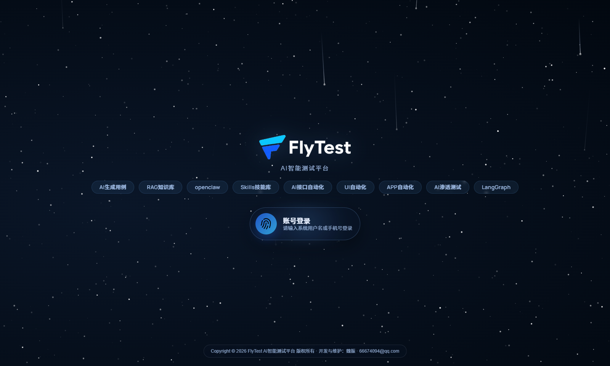
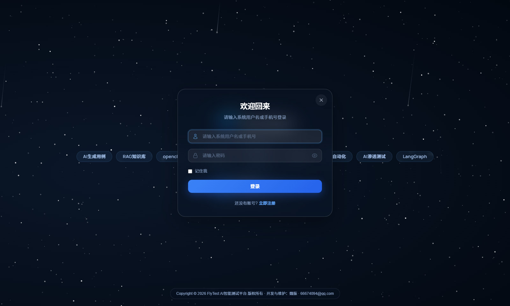
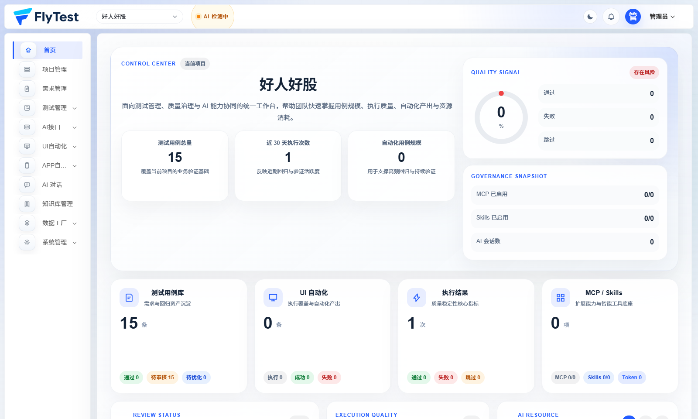
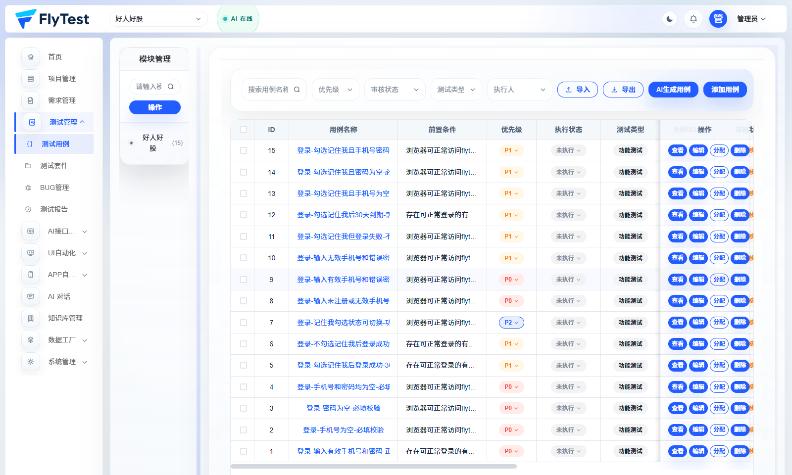
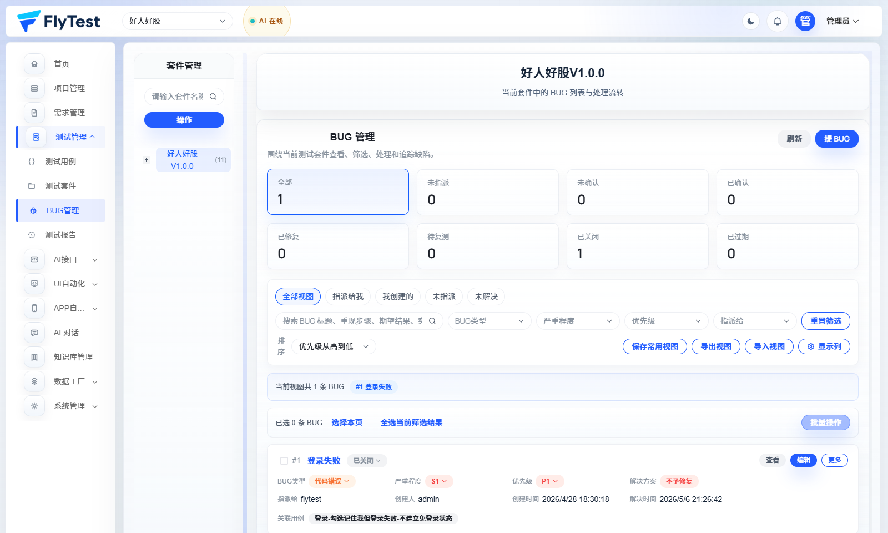
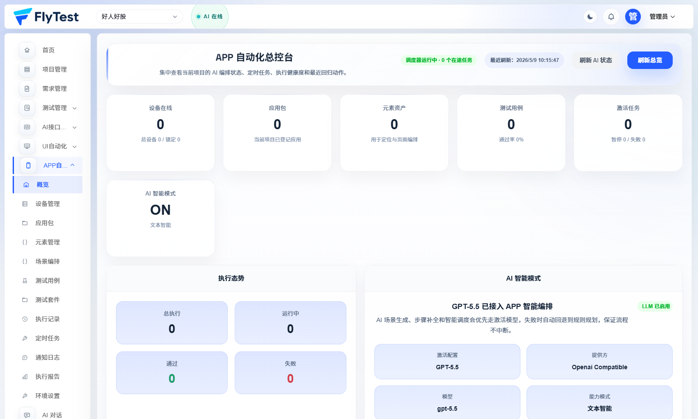
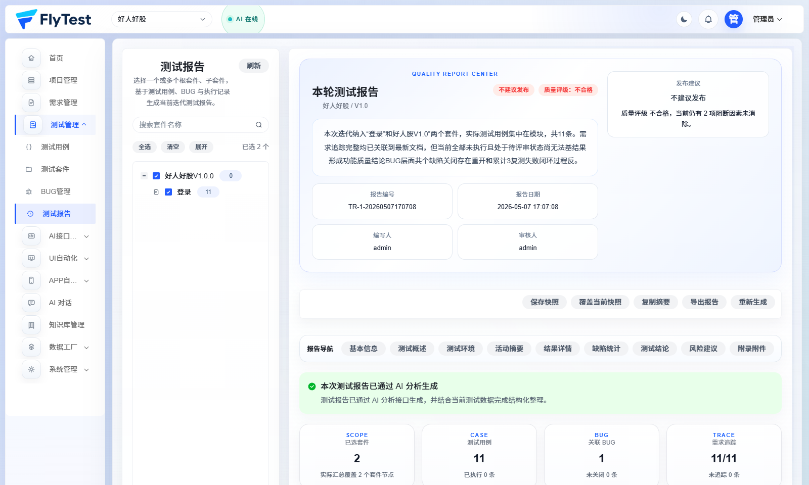
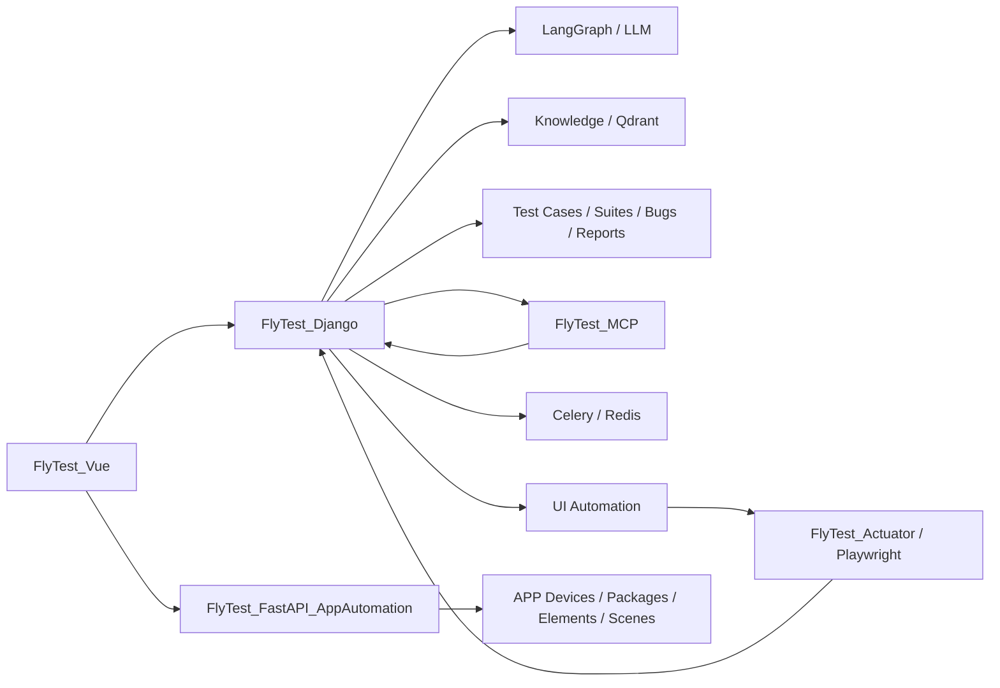

# FlyTest

FlyTest 是一个面向测试团队的 AI 智能测试平台，覆盖需求理解、AI 对话、测试用例、测试套件、BUG 管理、测试报告、知识库、API/UI/APP 自动化，以及 MCP / Skills 扩展能力。

[English](./README_EN.md)

## 项目定位

FlyTest 不是单点的“AI 生成用例”工具，而是把测试工作从需求到执行再到复盘串起来的一套平台：

- 需求文档上传、拆解、评审与报告生成
- 基于大模型和知识库的 AI 对话与测试设计
- 测试用例、测试套件、BUG、执行历史、测试报告统一管理
- API 自动化、UI 自动化、APP 自动化一体化协同
- MCP、Skills、执行器、通知等工程化扩展能力

## 页面截图

### 登录与入口

| 登录首页 | 登录弹窗 |
| --- | --- |
|  |  |

### 管理后台

| 首页工作台 | 测试用例 |
| --- | --- |
|  |  |

| BUG 管理 | APP 自动化 |
| --- | --- |
|  |  |

| 执行历史 | 测试工作台示意 |
| --- | --- |
|  |  |

## 核心能力

### 1. 需求管理

- 上传需求文档并按模块拆分
- 生成需求评审结果、问题清单、结构化建议
- 将需求上下文继续传递给测试设计和 AI 分析模块

### 2. AI 对话与智能测试设计

- 基于 LangGraph 的多阶段 AI 对话能力
- 支持提示词、知识库、Skills、工具调用协同
- 可将 AI 生成结果直接沉淀为测试用例、测试报告或分析结论

### 3. 测试资产管理

- 测试用例管理
- 测试套件管理
- BUG 管理
- 测试执行历史与测试报告
- 项目、成员、权限、通知统一协同

### 4. 知识库增强

- 文档上传、切片、向量化、检索、重排
- 为 AI 对话、需求评审、测试设计提供上下文增强
- 向量检索底层可接入 Qdrant

### 5. 自动化测试

- `API 自动化`：接口、环境、请求、断言、执行、报告
- `UI 自动化`：页面、步骤、Trace、执行器、批量执行
- `APP 自动化`：设备、应用包、元素、场景编排、测试用例、测试套件、执行记录、报告

### 6. 平台扩展能力

- MCP 服务接入
- Skills 管理与复用
- 执行器联动
- 站内通知与协作消息

## 当前仓库结构

| 目录 | 说明 |
| --- | --- |
| `FlyTest_Vue/` | Vue 3 + TypeScript 前端主应用 |
| `FlyTest_Django/` | Django + DRF 主后端，承载核心业务 API |
| `FlyTest_FastAPI_AppAutomation/` | APP 自动化独立服务 |
| `FlyTest_Actuator/` | UI 自动化执行器 |
| `FlyTest_MCP/` | MCP 工具服务 |
| `FlyTest_Skills/` | 项目内置 Skills |
| `docs/` | 项目文档与历史截图 |
| `deploy-scripts/` | 构建与部署脚本 |

## 前端主要模块

根据当前路由与功能目录，FlyTest 前端主要包含：

- 首页与个人中心
- 项目管理 / 用户管理 / 组织管理 / 权限管理
- 需求管理 / 需求文档详情 / 专项分析报告
- AI 对话 / LLM 配置 / Prompt 与图表能力
- 知识库管理 / Skills 管理 / MCP 远程配置 / API Key 管理
- 测试用例 / 测试套件 / BUG 管理 / 测试执行历史
- API 自动化 / UI 自动化 / APP 自动化
- 数据工厂 / 用例模板管理

## 后端主要领域

结合当前 Django 应用结构，主后端已覆盖这些核心领域：

- `accounts`：认证、注册、登录、个人中心
- `projects`：项目、成员、权限关联
- `testcases`：测试用例、套件、BUG、执行历史
- `requirements` 相关能力：需求文档、拆解、评审、报告
- `langgraph_integration`：AI 对话、多阶段生成
- `knowledge`：知识库、向量检索
- `api_automation`：接口自动化
- `ui_automation`：UI 自动化
- `site_notifications`：站内通知
- `skills` / `mcp_tools` / `api_keys`：平台扩展与安全接入

## 技术栈

### 前端

- Vue 3
- TypeScript
- Vite
- Pinia
- Arco Design Vue

### 后端

- Django 5
- Django REST Framework
- Channels / ASGI
- SimpleJWT
- Celery + Redis

### AI / 自动化 / 基础设施

- LangChain / LangGraph
- Qdrant
- FastAPI
- Playwright
- MCP
- Skills Runtime
- PostgreSQL / SQLite

## 系统架构



## 典型使用流程

1. 创建项目并配置成员与权限
2. 上传需求文档，完成拆解与评审
3. 在 AI 对话中结合需求、提示词、知识库生成测试设计
4. 沉淀测试用例并组织成测试套件
5. 在 API / UI / APP 自动化模块中执行测试
6. 提交和跟踪 BUG，查看执行记录与测试报告
7. 通过通知、报告、知识库持续沉淀测试资产

## 快速开始

### 方式一：Docker Compose

适合快速体验完整平台。

```bash
git clone https://github.com/flytestai/flytest.git
cd flytest
cp .env.example .env
docker compose up -d
```

默认端口：

- 前端：`http://localhost:8913`
- Django API：`http://localhost:8912`
- MCP：`http://localhost:8914`
- Playwright MCP：`http://localhost:8916`
- Qdrant：`http://localhost:8918`
- PostgreSQL：`localhost:8919`

默认管理员账号可通过环境变量覆盖；如果未修改，`docker-compose.yml` 中的默认值为：

- 用户名：`admin`
- 密码：`admin123456`

### 方式二：本地开发

#### 1. 启动 Django 后端

```bash
cd FlyTest_Django
python -m venv .venv
.venv\Scripts\activate
pip install -r requirements.txt
python manage.py migrate
python manage.py runserver 0.0.0.0:8000
```

#### 2. 启动前端

```bash
cd FlyTest_Vue
npm install
npm run dev -- --host 0.0.0.0 --port 5173
```

#### 3. 启动 APP 自动化服务

```bash
cd FlyTest_FastAPI_AppAutomation
python -m pip install -r requirements.txt
python -m uvicorn app.main:app --host 0.0.0.0 --port 8010 --reload
```

#### 4. 启动 MCP 服务

```bash
cd FlyTest_MCP
pip install -r requirements.txt
python FlyTest_tools.py
```

#### 5. 启动 UI 执行器

```bash
cd FlyTest_Actuator
pip install -r requirements.txt
python main.py
```

## 常用环境变量

建议从根目录 `.env.example` 开始配置。常用变量包括：

- `DATABASE_TYPE`
- `POSTGRES_HOST`
- `POSTGRES_DB`
- `POSTGRES_USER`
- `POSTGRES_PASSWORD`
- `DJANGO_SECRET_KEY`
- `DJANGO_ALLOWED_HOSTS`
- `DJANGO_CORS_ALLOWED_ORIGINS`
- `CELERY_BROKER_URL`
- `CELERY_RESULT_BACKEND`
- `QDRANT_URL`
- `FLYTEST_API_KEY`
- `FLYTEST_BACKEND_URL`
- `MEDIA_ROOT`

## 文档入口

- 快速开始：[docs/QUICK_START.md](./docs/QUICK_START.md)
- 项目文档首页：[docs/index.md](./docs/index.md)
- 后端说明：[FlyTest_Django/README.md](./FlyTest_Django/README.md)
- 前端说明：[FlyTest_Vue/README.md](./FlyTest_Vue/README.md)
- APP 自动化服务：[FlyTest_FastAPI_AppAutomation/README.md](./FlyTest_FastAPI_AppAutomation/README.md)
- UI 执行器：[FlyTest_Actuator/README.md](./FlyTest_Actuator/README.md)
- MCP 服务：[FlyTest_MCP/README.md](./FlyTest_MCP/README.md)

## 许可说明

当前项目采用 [PolyForm Noncommercial 1.0.0](./LICENSE)。

这意味着：

- 允许学习、研究、评估与内部非商业使用
- 允许在非商业前提下修改与分发
- 不允许直接用于商业交付、商业 SaaS 或收费部署

## 安全建议

- 默认配置更适合本地开发或受控内网环境
- 生产环境请务必修改管理员密码、API Key、密钥配置
- 对 MCP、Skills、执行器等高权限能力启用最小权限策略
- 对外部署前请补齐访问控制、审计、网关与备份策略
