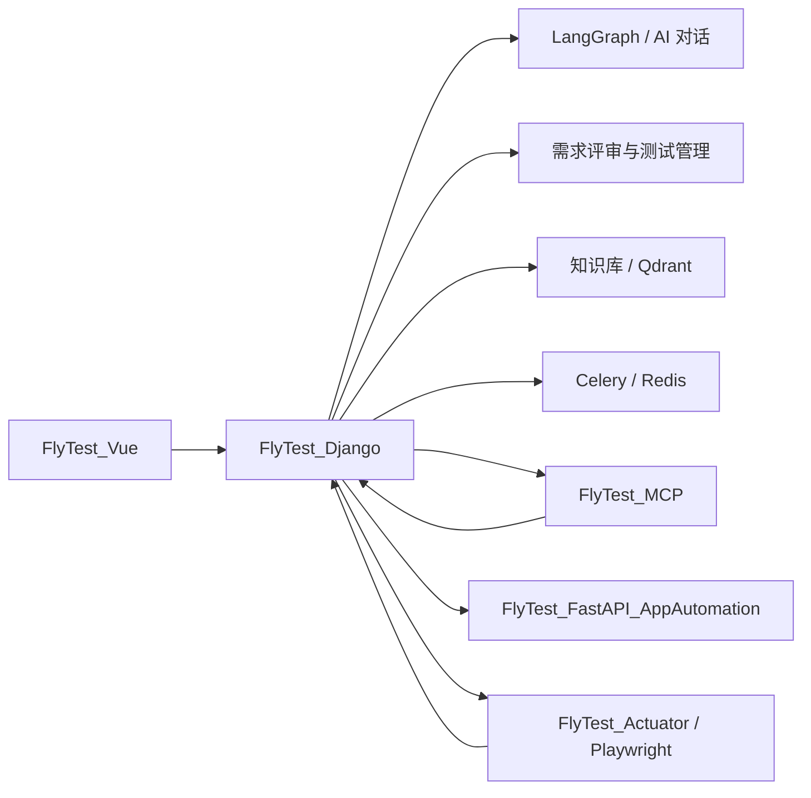

# FlyTest

FlyTest 是一套面向测试团队的 AI-Native 智能测试平台，覆盖需求理解、知识库增强、测试用例设计、测试资产管理，以及 API / UI / APP 自动化执行的完整链路。

[English](README_EN.md)

## 项目简介

FlyTest 不只是“AI 生成测试用例”工具，更强调把测试工作真正串起来：

- 从需求文档进入测试流程
- 用 AI 和知识库理解业务上下文
- 生成、评审、管理和优化测试用例
- 组织测试套件、执行结果、缺陷和历史记录
- 连接 MCP、Skills、执行器和自动化服务，把设计落到执行

## 核心能力

### 1. 需求管理与需求评审

- 上传需求文档或直接录入需求
- 支持文档拆分、模块化整理、结构化评审
- 生成需求评审报告、问题清单和模块级建议
- 将需求分析结果继续传递到测试设计环节

### 2. AI 对话与测试设计

- 基于 LangGraph 的对话式测试设计能力
- 支持提示词、知识库、Skills、工具调用协同
- 支持流式响应、会话历史、过程留痕
- AI 生成结果可直接保存为测试用例

### 3. 测试资产管理

- 项目、成员、权限统一管理
- 测试用例、测试套件、执行历史集中维护
- 支持模块树、层级组织、筛选、分配与执行状态跟踪
- 覆盖缺陷管理、执行记录和结果回溯

### 4. 知识库增强

- 项目级知识库管理
- 文档上传、切片、向量化、检索与重排
- 为 AI 对话、需求评审、测试设计提供上下文增强
- 向量存储基于 Qdrant

### 5. 自动化测试能力

- API 自动化：请求、用例、环境、执行记录、测试报告
- UI 自动化：页面与步骤管理、AI 智能模式、Trace 与执行留痕
- APP 自动化：设备、应用包、元素、场景、用例与执行记录
- 通过执行器和任务链路把测试资产落地执行

### 6. MCP 与 Skills 扩展

- 支持 MCP 服务接入与工具扩展
- 支持项目级 Skills 管理与复用
- 可结合内部工具、Playwright 工具链与自动化服务协同工作

## 仓库结构

| 目录 | 说明 |
| --- | --- |
| `FlyTest_Django/` | 主后端，负责业务 API、AI 对话、需求评审、知识库、测试管理 |
| `FlyTest_Vue/` | 主前端，基于 Vue 3 + TypeScript + Vite |
| `FlyTest_FastAPI_AppAutomation/` | APP 自动化独立服务 |
| `FlyTest_Actuator/` | UI 自动化执行器，负责实际浏览器执行 |
| `FlyTest_MCP/` | MCP 工具服务 |
| `FlyTest_Skills/` | 内置 Skills 仓库 |
| `docs/` | 项目文档 |
| `deploy-scripts/` | 启动与部署脚本 |
| `data/` | 运行期数据目录 |

## 技术栈

### 前端

- Vue 3
- TypeScript
- Vite
- Pinia
- Arco Design Vue

### 后端

- Django 5
- Django REST Framework
- Channels / Daphne
- SimpleJWT
- Celery + Redis
- LangChain / LangGraph

### AI / 检索 / 自动化

- OpenAI 兼容模型接入
- Qwen Provider 支持
- Qdrant
- Playwright
- FastAPI
- MCP
- Skills Runtime

## 系统架构



## 典型使用流程

1. 创建项目并配置成员权限
2. 上传需求文档并完成需求拆解
3. 发起需求评审，查看问题清单与结构化建议
4. 在 AI 对话中结合需求、提示词和知识库生成测试用例
5. 将结果保存到测试用例库并组织进测试套件
6. 在 API / UI / APP 自动化模块中继续编排与执行
7. 查看执行记录、缺陷、报告和 Trace，持续优化测试资产

## 快速开始

### 方式一：Docker Compose

适合快速体验完整能力。

```bash
git clone https://github.com/flytestai/flytest.git
cd flytest
cp .env.example .env
docker compose up -d
```

默认端口：

- 前端：`http://localhost:8913`
- 后端 API：`http://localhost:8912`
- MCP：`http://localhost:8914`
- Playwright MCP：`http://localhost:8916`
- Qdrant：`http://localhost:8918`
- PostgreSQL：`localhost:8919`

默认管理员账号可通过环境变量覆盖；未修改时，`docker-compose.yml` 中的默认值为：

- 用户名：`admin`
- 密码：`admin123456`

### 方式二：本地开发

#### 1. 启动 Django 后端

```bash
cd FlyTest_Django
python -m venv .venv
.venv\Scripts\activate
pip install -r requirements.txt
python manage.py migrate
python manage.py runserver 0.0.0.0:8000
```

#### 2. 启动 Vue 前端

```bash
cd FlyTest_Vue
npm install
npm run dev -- --host 0.0.0.0 --port 5173
```

#### 3. 启动 APP 自动化服务

```bash
cd FlyTest_FastAPI_AppAutomation
python -m pip install -r requirements.txt
python -m uvicorn app.main:app --host 0.0.0.0 --port 8010 --reload
```

#### 4. 启动 MCP 工具服务

```bash
cd FlyTest_MCP
pip install -r requirements.txt
python FlyTest_tools.py
```

#### 5. 启动 UI 执行器

```bash
cd FlyTest_Actuator
pip install -r requirements.txt
python main.py
```

## 常用配置项

建议从根目录 `.env.example` 开始配置。常见变量包括：

- `DATABASE_TYPE`
- `POSTGRES_HOST` / `POSTGRES_DB` / `POSTGRES_USER` / `POSTGRES_PASSWORD`
- `CELERY_BROKER_URL`
- `CELERY_RESULT_BACKEND`
- `UI_AUTOMATION_AI_USE_CELERY`
- `UI_AUTOMATION_CELERY_QUEUE`
- `DJANGO_SECRET_KEY`
- `DJANGO_ALLOWED_HOSTS`
- `DJANGO_CORS_ALLOWED_ORIGINS`
- `FLYTEST_API_KEY`
- `FLYTEST_BACKEND_URL`
- `QDRANT_URL`
- `MEDIA_ROOT`

## 相关文档

- 快速开始：[`docs/QUICK_START.md`](./docs/QUICK_START.md)
- Docker 部署：[`docker-compose.yml`](./docker-compose.yml)
- 后端说明：[`FlyTest_Django/README.md`](./FlyTest_Django/README.md)
- 前端说明：[`FlyTest_Vue/README.md`](./FlyTest_Vue/README.md)
- APP 自动化服务：[`FlyTest_FastAPI_AppAutomation/README.md`](./FlyTest_FastAPI_AppAutomation/README.md)
- UI 执行器：[`FlyTest_Actuator/README.md`](./FlyTest_Actuator/README.md)
- MCP 工具服务：[`FlyTest_MCP/README.md`](./FlyTest_MCP/README.md)
- 许可证说明：[`docs/license.md`](./docs/license.md)

## 授权说明

当前项目采用 [PolyForm Noncommercial 1.0.0](./LICENSE) 许可证。

这意味着：

- 允许学习、研究、评估和内部非商业使用
- 允许在非商业前提下修改和分发
- 不允许直接用于商业目的
- 商业部署、商业交付、SaaS 或客户项目使用需要单独授权

## 安全建议

- 默认配置更适合本地开发或受控内网环境
- 生产环境请务必修改默认管理员密码与 API Key
- 对 MCP、Skills、执行器等高权限能力启用最小权限原则
- 对外暴露服务前，请补齐访问控制、密钥管理、网关与审计策略
